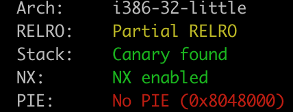
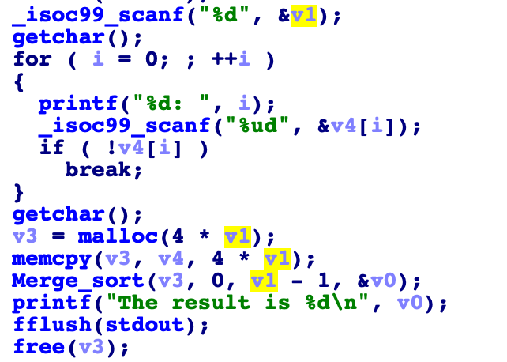

# 赛题设计说明

## 题目信息：

* 题目名称：inversion
* 预估难度：中等偏易
* 编译命令：gcc -m32 -fstack-protector-all -mpreferred-stack-boundary=2 --static -z noexecstack -o pwn

## 题目描述：

> Find inversion of your input. 

## 题目考点：

1. 逆向程序中计算逆序数的算法，理解工作原理
2. 绕过canary执行攻击32为的栈溢出程序
3. 32位的rop，静态编译情况下的getshell

## 思路简述：

逆向出程序求逆序数的算法，分析其中的溢出漏洞。
通过将canary一起带入逆序数的计算，来算出canary的值。直接栈溢出构造rop采用ret2text的方法来get shell。

## 题目提示：

1. 请尝试攻击canary
2. RopGadget
3. execve syscall

## 题目环境：

1. Ubuntu 18.04 LTS
2. xinetd + chroot

## 题目制作过程：

1. 编写 pwn.c 代码，详细代码请从 “源码” 文件夹获取，
2. 编译方式在源代码第一行，
3. 编写 xinetd 配置文件，设置好参数，
4. 生成 flag 文件。
5. 编写 Dockerfile。

注：如果是常规的 pwn 题，直接替换模板 docker 文件夹中的 pwn 以及 flag 文件即可，无需步骤3、4、5

## 题目 writeup：

1. 检查题目保护，发现无保护
  



2. 分析程序发现，输入个数没有被限制，可以栈溢出，但有canary

   

3. 继续分析，发现计算的逆序数的个数可以受控制，将cnaary带入一起计算逆序数，可以通过逆序数结果算出canary

4. 拿到canary，带入攻击payload，即可覆盖之后的返回地址

5. 由于题目是静态编译，无法使用常见的ret2libc攻击。但是静态编译使得程序自带了很多gadget，通过这些gadget结合触发点的上下文信息可以直接调用execve的syscall来进行get shell。
```c
 EAX  0x0
 EBX  0x80481e8 ◂— 0x0
 ECX  0x80ec96c (main_arena+1100) ◂— 0x212c0
 EDX  0x0
 EDI  0x0
 ESI  0x80ec00c (_GLOBAL_OFFSET_TABLE_+12) —▸ 0x80655f0 (__strcpy_ssse3) ◂— mov    edx, dword ptr [esp + 4]
 EBP  0x1
 ESP  0xff91ae44 ◂— 0x0
 EIP  0xdeadbeef
```
这里的目的是eax=11， ebx=&"/bin/sh", ecx=0, edx=0.
同时注意rop chain中不能出现0，否则会提前终止输入的操作。
通过`0x0808223e #: xchg eax, ecx; mov eax, esi; pop ebx; pop esi; pop edi; ret;`这条gadget可以同时将ecx置零并且将eax设为任意地址，具体的做法是将ebx设置为bss段上全局变量name的地址，我们可以在程序一开始就把name设置为/bin/sh。随后只要把eax设置为11再调用int 0x80的gadget就可以get shell了。

6. 编写 exp.py ，获取flag。

